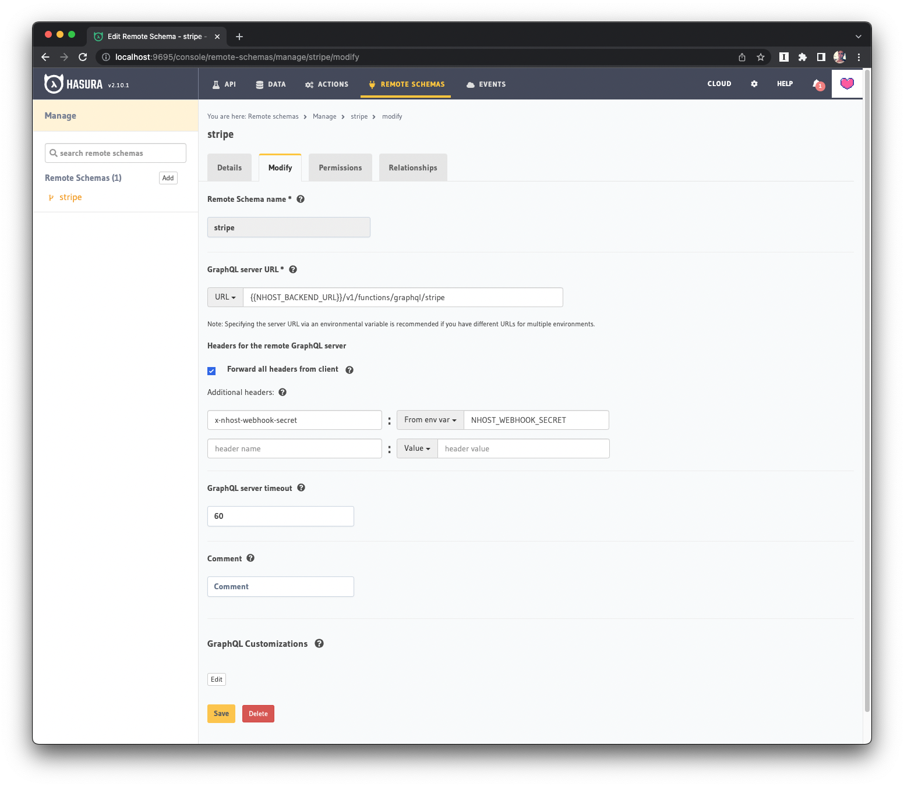

<h1 align="center">@nhost/stripe-graphql-js</h1>
<h2 align="center">Stripe GraphQL API</h2>

<p align="center">
  
  
  <a href="LICENSE">
    
  </a>
</p>

This package creates a Stripe GraphQL API.

```graphql
query {
  stripe {
    customer(id: "cus_xxx" {
      id
      name
      invoices {
        data {
          id
          created
          paid
          hostedInvoiceUrl
        }
      }
    }
  }
}
```

You can also add the Stripe GraphQL API as a Hasura Remote Schema and connect data from your database and Stripe. This allows you to request data from your database and Stripe in a single GraphQL query:

```graphql
query {
  users {
    # User in your database
    id
    displayName
    userData {
      stripeCustomerId # Customer's Stripe Customer Id
      stripeCustomer {
        # Data from Stripe
        id
        name
        paymentMethods {
          id
          card {
            brand
            last4
          }
        }
      }
    }
  }
}
```

## Install

```bash
npm install @nhost/stripe-graphql-js
```

## Quick Start

### Serverless Function Setup

Create a new [Serverless Function](https://docs.nhost.io/platform/serverless-functions) `functions/graphql/stripe.ts`:

```js
import { createStripeGraphQLServer } from '@nhost/stripe-graphql-js'

const server = createStripeGraphQLServer()

export default server
```

> You can run the Stripe GraphQL API in any JS environment because it's built using [GraphQL Yoga](https://github.com/dotansimha/graphql-yoga).

### Stripe Secret Key

Add `STRIPE_SECRET_KEY` as an environment variable. If you're usingn Nhost add `STRIPE_SECRET_KEY` to `.env.development` like this:

```
STRIPE_SECRET_KEY=sk_test_xxx
```

Learn more about [Stripe API keys](https://stripe.com/docs/keys#obtain-api-keys).

### Start Nhost

```
nhost up
```

Learn more about the [Nhost CLI](https://docs.nhost.io/platform/cli).

### Test

Test the Stripe GraphQL API in the browser:

[http://localhost:1337/v1/functions/graphql/stripe](http://localhost:1337/v1/functions/graphql/stripe)

### Remote Schema

Add the Stripe GraphQL API as a Remote Schema in Hasura.

**URL**

```
{{NHOST_BACKEND_URL}}/v1/functions/graphql/stripe
```

**Headers**

```
x-nhost-webhook-secret: NHOST_WEBHOOK_SECRET (from env var)
```



## Permissions

Here's a minimal example without any custom permissions. Only requests using the `x-hasura-admin-secret` header will work:

```js
const server = createStripeGraphQLServer()
```

For more granular permissions, you can pass an `isAllowed` function to the `createStripeGraphQLServer`. The `isAllowed` function takes a `stripeCustomerId` and [`context`](#context) as parameters and runs every time the GraphQL server makes a request to Stripe to get or modify data for a specific Stripe customer.

Here is an example of an `isAllowed` function:

```js

const isAllowed = (stripeCustomerId: string, context: Context) => {
  const { isAdmin, userClaims } = context

  // allow requests if it has a valid `x-hasura-admin-secret`
  if (isAdmin) {
    return true
  }

  // get user id
  const userId = userClaims['x-hasura-user-id']

  // check if user is signed in
  if (!userId) {
    return false;
  }

  // get more user information from the database
  const { user } = await gqlSDK.getUser({
    id: userId,
  });

  if (!user) {
    return false;
  }

  // check if the user is part of a workspace with the `stripeCustomerId`
  return user.workspaceMembers
    .some((workspaceMember) => {
      return workspaceMember.workspace.stripeCustomerId === stripeCustomerId;
    });
}

```

### Context

The `context` object contains:

- `userClaims` - verified JWT claims from the user's access token.
- `isAdmin` - `true` if the request was made using a valid `x-hasura-admin-secret` header.
- `request` - [Fetch API Request object](https://developer.mozilla.org/en-US/docs/Web/API/Request) that represents the incoming HTTP request in platform-independent way. It can be useful for accessing headers to authenticate a user
- `query` - the DocumentNode that was parsed from the GraphQL query string
- `operationName` - the operation name selected from the incoming query
- `variables` - the variables that were defined in the query
- `extensions` - the extensions that were received from the client

Read more about the [default context from GraphQL Yoga](https://www.the-guild.dev/graphql/yoga-server/docs/features/context#default-context).

## Development

Install dependencies:

```bash
pnpm install
```

Start the development server:

```bash
pnpm dev
```

The GraphQL Server will reload every time the code changes.

Open GraphiQL:

[http://0.0.0.0:4000/graphql](http://0.0.0.0:4000/graphql)
